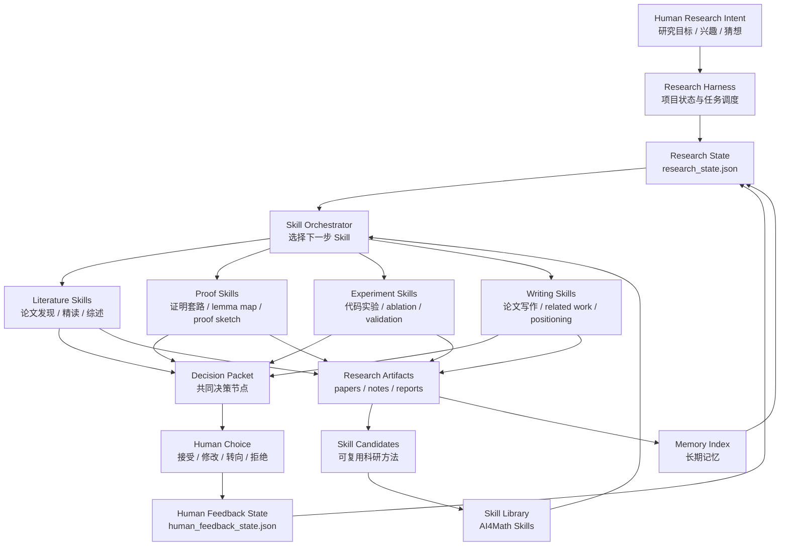
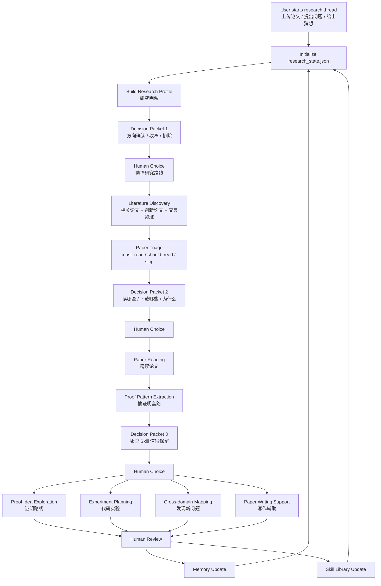
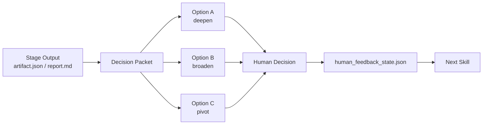

# AI4Math Auto Research Harness: Human-AI Research Loop Design

## 1. Vision

The goal is to explore how LLMs and coding agents can assist mathematical research through a persistent, interactive research loop.

目标不是让 AI 一次性回答一个数学问题，而是构建一套基于 Codex / coding agent 的科研闭环系统：

- 自动阅读论文；
- 抽取证明套路；
- 生成代码实验；
- 提供证明思路；
- 发现交叉领域中的新问题；
- 辅助论文写作；
- 在持续人机交互中积累记忆；
- 将高价值科研方法沉淀为可复用 Skill。

核心范式：

```text
Codex proposes -> human decides -> Codex acts -> artifacts accumulate -> Skills improve -> memory updates
```

## 2. System Thesis

AI4Math Auto Research should be built as a harness around:

- tool calling;
- memory accumulation;
- Skill distillation;
- human decision checkpoints.

The harness should not be a monolithic research agent. It should coordinate smaller research Skills and preserve every important intermediate artifact.

```text
Harness = state manager + tool router + decision loop + memory writer + Skill orchestrator
```

The user is not merely a final evaluator. The user continuously steers the research route.

## 3. High-Level Architecture



## 4. Core Files And State

The minimal harness should standardize five state files.

```text
research_state.json
human_feedback_state.json
decision_packet.json
skill_registry.json
memory_index.json
```

### 4.1 `research_state.json`

Tracks the current research project.

Suggested contents:

- research question;
- active hypotheses;
- seed papers;
- paper pool;
- reading plan;
- proof goals;
- experiment goals;
- writing goals;
- current stage;
- unresolved blockers.

### 4.2 `human_feedback_state.json`

Tracks how the human has redirected Codex.

Suggested contents:

- focus updates;
- negative preferences;
- paper decisions;
- Skill decisions;
- proof route decisions;
- experiment decisions;
- writing direction decisions;
- next-step directives.

### 4.3 `decision_packet.json`

The main artifact for共同决策.

Each packet should contain:

- current findings;
- open uncertainty;
- 2-3 next-step options;
- Codex recommendation;
- risks;
- required human decision;
- expected artifact after the selected action.

Example:

```json
{
  "stage": "triage_review",
  "current_findings": [
    "Two papers contain strong Wasserstein error proof patterns.",
    "Several adjacent papers are useful only for positioning."
  ],
  "options": [
    {
      "id": "A",
      "action": "download_and_extract_two_core_theory_papers",
      "benefit": "Fastest path to reusable proof-pattern Skills.",
      "risk": "May miss broader related-work context."
    },
    {
      "id": "B",
      "action": "expand_retrieval_to_lower_bound_papers",
      "benefit": "May reveal sharper novelty gaps.",
      "risk": "Slower and more speculative."
    }
  ],
  "codex_recommendation": "A",
  "human_decision_required": "Choose next research action."
}
```

### 4.4 `skill_registry.json`

Tracks available and emerging Skills.

Suggested groups:

- literature Skills;
- proof Skills;
- experiment Skills;
- writing Skills;
- memory Skills;
- orchestration Skills.

### 4.5 `memory_index.json`

Tracks reusable research memory.

Suggested memory types:

- paper memory;
- theorem memory;
- proof-pattern memory;
- experiment memory;
- failure memory;
- writing memory;
- user preference memory.

## 5. Research Loop



## 6. Skill Modules

### 6.1 Literature Intelligence

Purpose:

- read seed papers;
- build a research profile;
- retrieve related work;
- retrieve innovation papers;
- triage papers;
- identify positioning gaps.

Existing module:

```text
ai4math-paper-skills
```

Relevant Skills:

- `seed-paper-profiler`
- `related-paper-retriever`
- `innovation-paper-finder`
- `paper-triage-ranker`
- `paper-pdf-downloader`
- `pdf-to-markdown-converter`

### 6.2 Proof Intelligence

Purpose:

- extract proof patterns;
- map theorem / lemma dependencies;
- generate proof sketches;
- compare proof strategies;
- identify missing assumptions;
- propose proof routes.

Possible Skills:

- `paper-to-skill-extractor`
- `lemma-dependency-mapper`
- `proof-strategy-generator`
- `assumption-gap-checker`
- `counterexample-seeker`
- `formalization-readiness-checker`

### 6.3 Experiment Intelligence

Purpose:

- convert research ideas into minimal experiments;
- generate code prototypes;
- design sanity checks;
- identify measurable claims;
- record reusable experiment recipes.

Possible Skills:

- `experiment-prototype-planner`
- `code-experiment-generator`
- `ablation-plan-builder`
- `result-interpretation-assistant`
- `experiment-to-skill-extractor`

### 6.4 Cross-Domain Discovery

Purpose:

- find techniques from adjacent fields;
- identify transferable proof methods;
- discover new problem formulations;
- map conceptual analogies.

Possible Skills:

- `cross-domain-paper-finder`
- `method-transfer-mapper`
- `research-opportunity-ranker`
- `novelty-gap-analyzer`

### 6.5 Writing Intelligence

Purpose:

- draft related work;
- sharpen positioning;
- turn proof sketches into paper prose;
- produce experiment sections;
- maintain claims and evidence alignment.

Possible Skills:

- `paper-positioning-assistant`
- `related-work-synthesizer`
- `proof-section-drafter`
- `experiment-section-drafter`
- `claim-evidence-checker`

### 6.6 Memory And Skill Distillation

Purpose:

- turn repeated research behavior into reusable memory;
- cluster proof and experiment patterns;
- generate library-ready Skill Cards;
- maintain user preference memory.

Possible Skills:

- `cross-paper-skill-synthesizer`
- `memory-index-updater`
- `skill-library-curator`
- `failure-pattern-miner`
- `user-preference-profiler`

## 7. Shared Decision Packet Pattern

Every major stage should produce a decision packet.



Decision packet format:

```text
decision_packet.json
decision_packet.md
```

Recommended fields:

- `stage`
- `trigger_artifacts`
- `summary`
- `uncertainties`
- `options`
- `codex_recommendation`
- `human_decision_required`
- `effect_on_next_state`

## 8. Tool Layer

The harness should expose tools through Codex rather than hiding everything inside one Python pipeline.

Tool categories:

- search and browsing;
- PDF download;
- PDF-to-Markdown conversion;
- code execution;
- test running;
- Git;
- LaTeX / Markdown writing;
- optional Lean / theorem proving;
- local memory read/write;
- document generation.

Design rule:

```text
Skills decide what to do.
Tools execute concrete operations.
Harness preserves state and checkpoints.
Human chooses direction.
```

## 9. Memory Layer

Memory should not be a vague chat transcript. It should be indexed by reusable research function.

Suggested memory folders:

```text
memory/
├── papers/
├── proof_patterns/
├── experiment_recipes/
├── writing_patterns/
├── failed_routes/
├── user_preferences/
└── skill_candidates/
```

Memory update policy:

- record only reusable insights;
- preserve source references;
- distinguish accepted memory from speculative memory;
- connect memory items to Skills when possible;
- keep failed routes so the system does not repeat them blindly.

## 10. Roadmap

### Phase 1: Paper-to-Skill Submodule

Status: current direction.

Goal:

- read papers;
- retrieve related work;
- triage;
- extract proof patterns;
- synthesize Skill Cards.

Primary repository:

```text
ai4math-paper-skills
```

### Phase 2: Decision Harness

Goal:

- add `research_state.json`;
- add `decision_packet.json`;
- upgrade `human_feedback_state.json`;
- require decision packets at key stages.

This is the next natural step.

### Phase 3: Proof And Experiment Engines

Goal:

- generate proof ideas;
- generate minimal code experiments;
- convert proof and experiment workflows into reusable Skills.

### Phase 4: Memory-to-Skill Loop

Goal:

- turn successful proof patterns, experiment flows, and writing patterns into long-term memory;
- promote stable patterns into Skill Cards.

### Phase 5: AI4Math Auto Research Harness

Goal:

- orchestrate literature, proof, experiment, writing, memory, and Skill distillation modules;
- support long-running human-AI research projects.

## 11. MVP Recommendation

The next MVP should not be a full autonomous research agent.

The next MVP should be:

```text
AI4Math Auto Research Harness v0.1
= research_state.json
+ human_feedback_state.json
+ decision_packet.json
+ existing paper-to-skill Skills
+ one reproducible end-to-end example
```

Success criteria:

- Codex can propose 2-3 next-step research actions after each key stage.
- The human can choose, revise, or reject the proposed route.
- The choice is written into state.
- The next Skill reads that state and changes behavior.
- Useful proof patterns or experiment recipes are promoted into Skill candidates.

This creates the first real version of:

```text
tool calling + memory accumulation + Skill distillation + human decision loop
```

