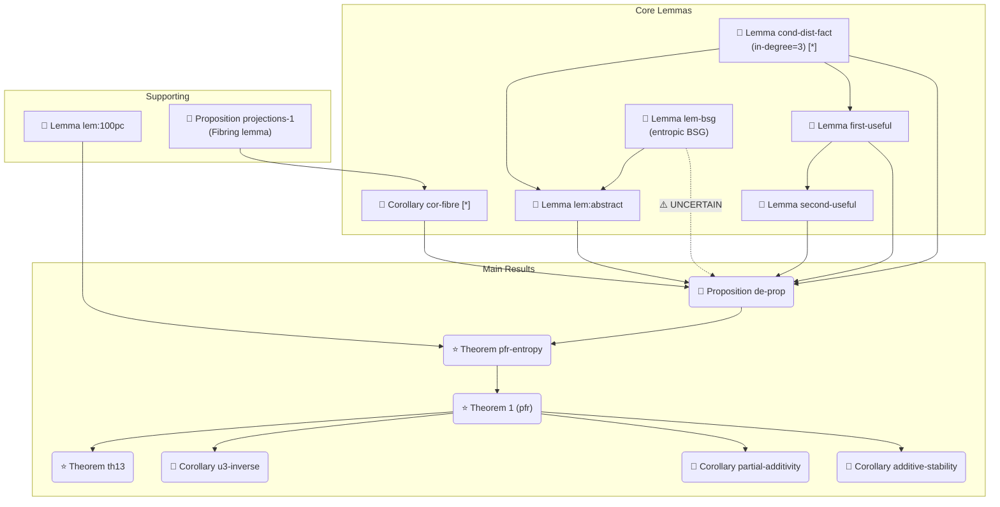

## 🗺️ 全文依赖图谱 — On a conjecture of Marton

> **数据来源**：`gowers2024_marton_structure.json`

### 0. 元信息

| 字段 | 内容 |
|:---|:---|
| 数据源 | `gowers2024_marton_structure.json` |
| 标题 | On a conjecture of Marton |
| 作者 | W. T. Gowers, Ben Green, Freddie Manners, Terence Tao |
| 年份 | 2024 |
| arXiv | 2311.05762 |
| 主定理 | Theorem 1 (pfr), Theorem pfr-entropy, Proposition de-prop |

### 1. 全节点拓扑分析（入度/出度）

| ID | 类型 | 符号 | 入度 | 出度 | 共享 |
|:---|:---|:---:|:---:|:---:|:---:|
| Theorem 1 (pfr) | THEOREM | ⭐ | 4 | 1 | — |
| Theorem pfr-entropy | THEOREM | ⭐ | 1 | 2 | — |
| Proposition de-prop | PROPOSITION | 📐 | 1 | 5 | — |
| Lemma lem:100pc | LEMMA | 🔧 | 1 | 0 | — |
| Proposition projections-1 | PROPOSITION | 📐 | 1 | 1 | — |
| Corollary cor-fibre | COROLLARY | 📎 | 1 | 1 | **共享枢纽** |
| **Lemma cond-dist-fact** | LEMMA | 🔧 | **3** | 0 | **共享枢纽** |
| Lemma first-useful | LEMMA | 🔧 | 2 | 1 | — |
| Lemma second-useful | LEMMA | 🔧 | 1 | 1 | — |
| Lemma lem:abstract | LEMMA | 🔧 | 1 | 2 | — |
| Lemma lem-bsg | LEMMA | 🔧 | 1 | 0 | — |
| Corollary additive-stability | COROLLARY | 📎 | 0 | 1 | — |
| Corollary partial-additivity | COROLLARY | 📎 | 0 | 1 | — |
| Corollary u3-inverse | COROLLARY | 📎 | 0 | 1 | — |
| Theorem th13 | THEOREM | ⭐ | 0 | 1 | — |

**结论：Lemma cond-dist-fact 入度最高（3），且为共享枢纽节点，同时被 Proposition de-prop、Lemma first-useful、Lemma lem:abstract 引用。**

### 2. 全局依赖图



### 3. 关键路径识别

- **最长依赖链**：Prop_projections_1 → Cor_fibre → Prop_de_prop → Thm_pfr_entropy → Thm1_pfr → Thm_th13 (6层)
- **核心枢纽节点**：
  - **Lemma cond-dist-fact**（入度=3，被 Prop_de_prop + Lemma first-useful + Lemma abstract 同时依赖）
  - **Corollary cor-fibre**（入度=1，出度=1，但承载 Prop_de_prop 的核心工具）
- **特征 2 关键依赖**：Lemma lem:abstract 中 $U+V+W=0$ 的唯一使用位置

### 4. 复现执行顺序（Bottom-up）

1. 基础工具：Proposition projections-1, Lemma lem:100pc
2. 技术引理：Corollary cor-fibre, Lemma cond-dist-fact, Lemma first-useful
3. 复合引理：Lemma second-useful, Lemma lem:abstract (依赖 BSG)
4. 主引理：Proposition de-prop (整合所有工具)
5. 核心定理：Theorem pfr-entropy (由 de-prop + lem:100pc 推导)
6. 最终结果：Theorem 1 (pfr) + 各推论

### 5. 预警与外部依赖

**外部依赖**：
| 引用 | 用于 | 说明 |
|:---|:---|:---|
| 📎 [tao-entropy Thm 1.11(i)] | Lemma lem:100pc | 熵距离零 → 子群 |
| 📎 [Madiman / KV inequality] | Lemma first-useful | 熵次可加性 |
| 📎 [tao-entropy Lemma 3.3] | Lemma lem-bsg | 熵 BSG 引理（本文给出更优常数） |

**UNCERTAIN 依赖**：
- ⚠️ Lemma lem-bsg → Proposition de-prop：通过 Lemma lem:abstract 间接使用

---

## 📐 深度推导 Lemma cond-dist-fact

> **数据来源**：`gowers2024_marton_structure.json`
> **标签**：Lemma cond-dist-fact | **入度=3**（最高）| **共享枢纽节点**

### 0. 为什么是核心枢纽？

Lemma cond-dist-fact 同时被三个关键节点依赖：
1. **Proposition de-prop**（全篇主引理，§5 证明中使用）
2. **Lemma first-useful**（§5 第二次不等式推导中引用）
3. **Lemma lem:abstract**（终局论证的抽象引理，§7 中使用）

这意味着它贯穿了论文的三个主要技术阶段，是承上启下的基础性不等式。

### L3.1 假设与结论拆解

**原文假设**：
- $(X, Z)$ 和 $(Y, W)$ 是随机变量对（不需独立）
- $X, Y$ 取值于某个交换群 $G$

**形式化结论**：
$$ \mathbf{d}(X \,|\, Z \;,\; Y \,|\, W) \;\leq\; \mathbf{d}(X, Y) \;+\; \frac{1}{2} \mathbf{I}(X : Z) \;+\; \frac{1}{2} \mathbf{I}(Y : W) $$

其中 $\mathbf{d}(X|Z, Y|W)$ 是**条件 Ruzsa 距离**，定义为：
$$ \mathbf{d}(X | Z \;,\; Y | W) := \sum_{z,w} p_Z(z) p_W(w) \; \mathbf{d}\bigl((X|Z=z),\; (Y|W=w)\bigr) $$

**假设分析**：
- 对 $(X,Z)$ 和 $(Y,W)$ 的联合分布无任何要求（不需要独立）
- 结论中 $\mathbf{d}(X,Y)$ 是**无条件** Ruzsa 距离，$\mathbf{I}(X:Z)$ 是互信息

### L3.2 符号全映射（局部）

| 符号 | 类型 | 定义 |
|:---|:---|:---|
| $\mathbf{d}(X|Z, Y|W)$ | 实数 | 条件 Ruzsa 距离（见上面公式） |
| $\mathbf{d}(X,Y)$ | 实数 | Ruzsa 熵距离 $H(X'-Y') - \frac12 H(X') - \frac12 H(Y')$ |
| $\mathbf{I}(X:Z)$ | 实数 | 互信息 $H(X) + H(Z) - H(X,Z) = H(X) - H(X|Z)$ |
| $(X',Z')$ | 随机变量 | $(X,Z)$ 的独立拷贝 |
| $H(X|Z)$ | 实数 | 条件熵 $\sum_z p_Z(z) H(X|Z=z)$ |

### L3.3 逻辑跳跃填补（3处跳跃）

#### 📍 跳跃 1：从条件距离定义到条件熵表达式

**原文**（§A, Eq. cond-dist-alt）：
> $\mathbf{d}(X|Z, Y|W) = \mathbf{H}(X'-Y' \,|\, Z',W') - \frac12 \mathbf{H}(X' \,|\, Z') - \frac12 \mathbf{H}(Y' \,|\, W')$

**补全**：
展开定义：
$$
\begin{aligned}
\mathbf{d}(X|Z, Y|W)
&= \sum_{z,w} p_Z(z) p_W(w) \; \mathbf{d}\bigl((X|Z=z), (Y|W=w)\bigr) \\
&= \sum_{z,w} p_Z(z) p_W(w) \Bigl[ \mathbf{H}\bigl((X'|Z'=z) - (Y'|W'=w)\bigr) \\
&\qquad\qquad\qquad\qquad - \tfrac12 \mathbf{H}(X'|Z'=z) - \tfrac12 \mathbf{H}(Y'|W'=w) \Bigr] \\
&= \mathbf{H}(X'-Y' \,|\, Z',W') - \tfrac12 \mathbf{H}(X'|Z') - \tfrac12 \mathbf{H}(Y'|W')
\end{aligned}
$$

这里 $(X',Z')$ 和 $(Y',W')$ 分别是 $(X,Z)$ 和 $(Y,W)$ 的独立拷贝。最后一步利用了：条件熵 $\mathbf{H}(A|B) = \sum_b p_B(b) \mathbf{H}(A|B=b)$。

> **难度评估**：trivial — 纯定义展开，无技术难度。

---

#### 📍 跳跃 2：用无条件熵上界替换条件熵（核心步骤）

**原文**（§5, line 683）：
> "In the middle step, we used $\mathbf{H}(X'-Y'|Z',W') \leq \mathbf{H}(X'-Y')$"

**补全**：
这是**条件作用减少熵**（conditioning reduces entropy）原理的直接应用：
$$ \mathbf{H}(A|B) \leq \mathbf{H}(A) $$

对任意随机变量 $A,B$ 成立。这里 $A = X'-Y'$，$B = (Z',W')$，因此：
$$ \mathbf{H}(X'-Y'|Z',W') \leq \mathbf{H}(X'-Y') $$

代入后得到：
$$
\begin{aligned}
\mathbf{d}(X|Z, Y|W)
&\leq \mathbf{H}(X'-Y') - \tfrac12 \mathbf{H}(X'|Z') - \tfrac12 \mathbf{H}(Y'|W') \\
&= \mathbf{d}(X',Y') + \tfrac12 \mathbf{H}(X') + \tfrac12 \mathbf{H}(Y') \\
&\qquad - \tfrac12 \mathbf{H}(X'|Z') - \tfrac12 \mathbf{H}(Y'|W')
\end{aligned}
$$

其中第二步用了 Ruzsa 距离的定义 $\mathbf{d}(X',Y') = \mathbf{H}(X'-Y') - \frac12\mathbf{H}(X') - \frac12\mathbf{H}(Y')$ 来替换 $\mathbf{H}(X'-Y')$。

> **难度评估**：trivial — 标准信息论不等式。

---

#### 📍 跳跃 3：将条件熵差值转化为互信息

**原文**（§5, line 684–686）：
> "and in the last step we used the definitions of $\mathbf{d}(-,-)$ and $\mathbf{I}(-)$."

**补全**：
利用互信息的等价定义 $\mathbf{I}(X:Z) = \mathbf{H}(X) - \mathbf{H}(X|Z)$，将跳跃 2 的结果继续化简：
$$
\begin{aligned}
\mathbf{d}(X|Z, Y|W)
&\leq \mathbf{d}(X',Y') + \tfrac12 \bigl(\mathbf{H}(X') - \mathbf{H}(X'|Z')\bigr) + \tfrac12 \bigl(\mathbf{H}(Y') - \mathbf{H}(Y'|W')\bigr) \\
&= \mathbf{d}(X',Y') + \tfrac12 \mathbf{I}(X':Z') + \tfrac12 \mathbf{I}(Y':W')
\end{aligned}
$$

由于 $(X',Z')$ 和 $(Y',W')$ 分别是 $(X,Z)$ 和 $(Y,W)$ 的独立拷贝，有 $\mathbf{d}(X',Y') = \mathbf{d}(X,Y)$ 和 $\mathbf{I}(X':Z') = \mathbf{I}(X:Z)$，$\mathbf{I}(Y':W') = \mathbf{I}(Y:W)$。代入即得：
$$ \mathbf{d}(X|Z, Y|W) \leq \mathbf{d}(X,Y) + \tfrac12 \mathbf{I}(X:Z) + \tfrac12 \mathbf{I}(Y:W) $$

> **难度评估**：trivial — 纯代数整理，零技术难度。

### L3.4 依赖图（Lemma cond-dist-fact 的局部角色）

```
Lemma cond-dist-fact (入度=3)
├──→ Proposition de-prop (§5 First estimate)
│   ├── 作用：对四种候选构造给出距离下界
│   └── 被 use：结合 cor-fibre 和 first-useful 推导 I₁ 上界
├──→ Lemma first-useful (§5, Eq. ruzsa-3)
│   └── 作用：推导 (ruzsa-3), d(X,Y|Y-Z) - d(X,Y) ≤ ...
└──→ Lemma lem:abstract (§7 Endgame)
    └── 作用：bound 条件距离项确保 BSG 构造的 ψ 泛函可控
```

### 完整推导一览（合并版）

$$
\begin{aligned}
\mathbf{d}(X|Z, Y|W)
&= \sum_{z,w} p_Z(z) p_W(w) \; \mathbf{d}\bigl((X|Z=z), (Y|W=w)\bigr) \\
&= \mathbf{H}(X'-Y'|Z',W') - \tfrac12 \mathbf{H}(X'|Z') - \tfrac12 \mathbf{H}(Y'|W') \\
&\leq \mathbf{H}(X'-Y') - \tfrac12 \mathbf{H}(X'|Z') - \tfrac12 \mathbf{H}(Y'|W') \qquad (\text{条件减熵}) \\
&= \bigl[\mathbf{d}(X',Y') + \tfrac12 \mathbf{H}(X') + \tfrac12 \mathbf{H}(Y')\bigr] - \tfrac12 \mathbf{H}(X'|Z') - \tfrac12 \mathbf{H}(Y'|W') \\
&= \mathbf{d}(X',Y') + \tfrac12 \bigl[\mathbf{H}(X') - \mathbf{H}(X'|Z')\bigr] + \tfrac12 \bigl[\mathbf{H}(Y') - \mathbf{H}(Y'|W')\bigr] \\
&= \mathbf{d}(X',Y') + \tfrac12 \mathbf{I}(X':Z') + \tfrac12 \mathbf{I}(Y':W') \\
&= \mathbf{d}(X,Y) + \tfrac12 \mathbf{I}(X:Z) + \tfrac12 \mathbf{I}(Y:W) \quad \blacksquare
\end{aligned}
$$

**本质上**：该引理说明"条件化"对 Ruzsa 距离的恶化程度至多是被条件变量的互信息的一半。它是信息论中"conditioning reduces entropy"这一基本事实在 Ruzsa 距离下的直接推论，结构简单、证明直接，但因其普适性而被反复调用。
